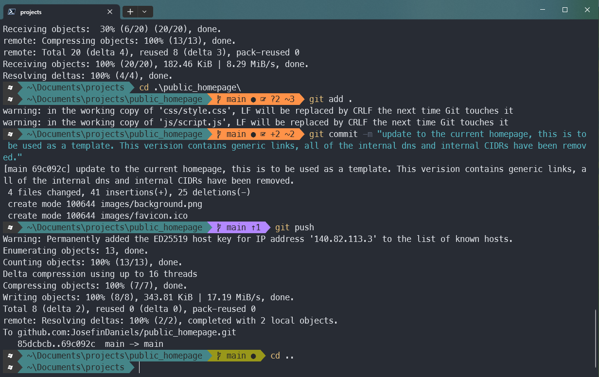

# Setup Instructions

## Installation

Install [scoop](https://scoop.sh/)

``scoop install curl neovim``

Install modules

``Install-Module posh-git -Scope CurrentUser -Force``

``Install-Module oh-my-posh -Scope CurrentUser -Force``

``Install-Module -Name Terminal-Icons -Repository PSGallery -Force``

## Create configs

Create a reference to your profile.ps1

``nvim $PROFILE.CurrentUserCurrentHost``

``. $env:USERPROFILE\.config\powershell\user_profile.ps1``  

